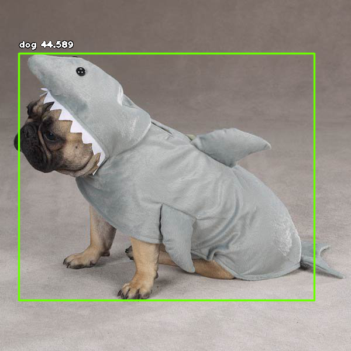

# Custom Object Detection using Tensorflow API

This Project is used to train custom object detection using Tesorflow api
Creating accurate machine learning models capable of localizing and identifying
multiple objects in a single image remains a core challenge in computer vision.
The TensorFlow Object Detection API is an open source framework built on top of
TensorFlow that makes it easy to construct, train and deploy object detection
models.
This project is trained solely for small dataset of class dog

  

https://colab.research.google.com/drive/1bBMWKeAUsNU3In-MrqhCvQBZDktJpRCM?usp=sharing
